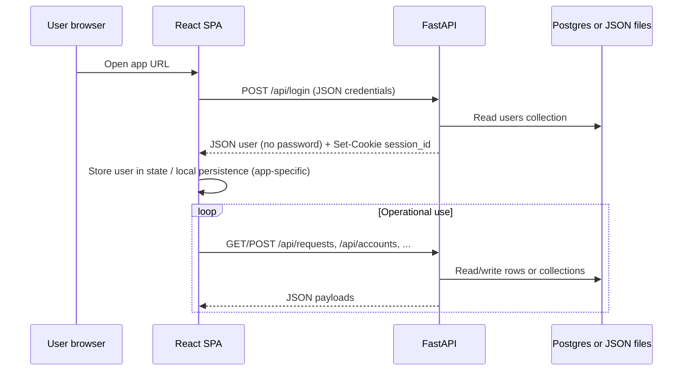
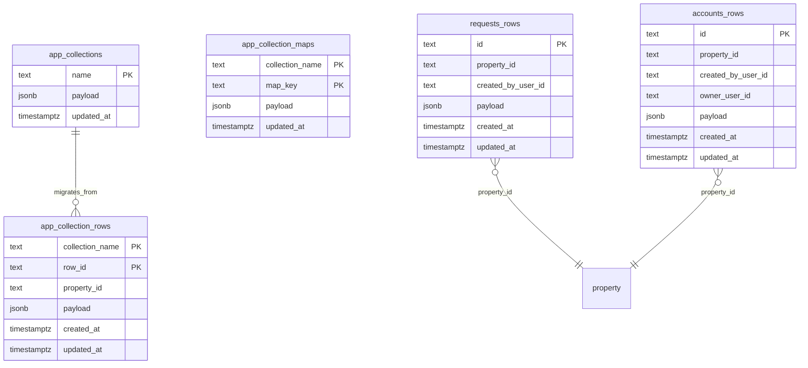
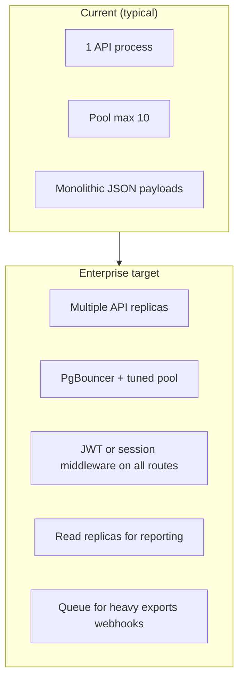
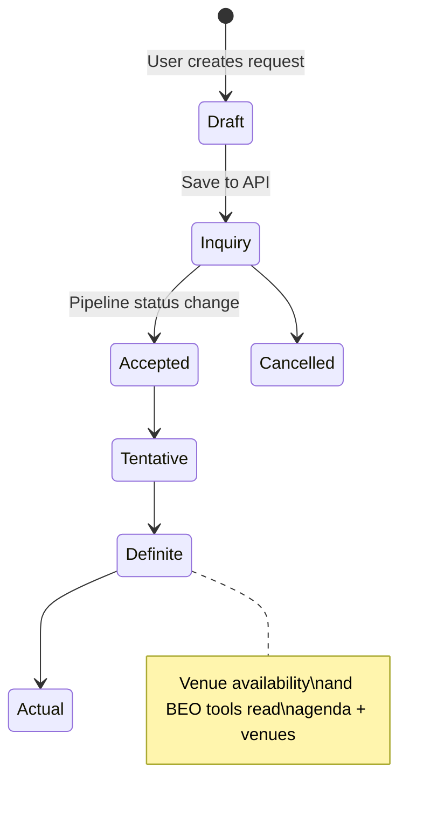

# Advanced Sales (VisaTour ERP) — Technical Overview for Enterprise Evaluation

**Audience:** IT architecture, security, and integration teams at large hospitality groups.  
**Codebase:** React (Vite) SPA + FastAPI (Python) backend; optional PostgreSQL or JSON file storage.  
**Document version:** 1.0 (generated from repository analysis, April 2026).

---

## 1. Executive summary

| Area | Summary |
|------|---------|
| **Purpose** | Sales and operations workspace: properties, users, accommodation/MICE **requests**, **accounts/CRM**, **tasks**, **contracts**, **financials**, calendar/events views, reports, file uploads (Cloudinary). |
| **Frontend** | **React 18**, **TypeScript** (mixed with JSX), **Vite 5**, **Tailwind CSS**, **Recharts**, client-side document generation (**jsPDF**, **docxtemplater**, **xlsx**). |
| **Backend** | **Python**, **FastAPI**, **Pydantic**, **Uvicorn**; persistence via **PostgreSQL** (`DATABASE_URL`) or local **JSON files** under `backend/data/`. |
| **Multi-tenant model** | **Property-scoped** data (`propertyId` on requests, accounts, filters); users assigned to properties; RBAC in the SPA (`userPermissions.ts`). |
| **API style** | REST JSON under `/api/...`; no formal OpenAPI publish step in-repo (FastAPI can expose `/docs` automatically in dev). |

**Scale framing (your scenario ~3,000 hotels × ~4 users ≈ 12,000 named users):** the current codebase is architected as a **modular monolith** with a **single API process** and a **small DB connection pool** in PostgreSQL mode. Serving **twelve thousand hospitality users** reliably requires **infrastructure and application hardening** beyond what the repo alone guarantees. Section 8 lists concrete enhancements.

---

## 2. System context (high level)

```mermaid
flowchart LR
  subgraph clients["Clients"]
    B["Browser (React SPA)"]
  end
  subgraph edge["Typical production edge"]
    CDN["Static host / CDN"]
    LB["Load balancer / TLS"]
  end
  subgraph app["Application tier"]
    API["FastAPI (Uvicorn)"]
  end
  subgraph data["Data tier"]
    PG[("PostgreSQL")]
    FS["JSON files (dev / no DATABASE_URL)")]
  end
  subgraph ext["External services"]
    CL["Cloudinary (signed uploads)"]
  end
  B --> CDN
  B --> LB
  LB --> API
  API --> PG
  API --> FS
  B -. optional direct .-> CL
  API --> CL
```

- **Development:** Vite serves the SPA (e.g. port **5173**) and proxies `/api` to the API (**127.0.0.1:8000**) per `vite.config.js`.  
- **Production:** set `VITE_API_BASE_URL` to the public API origin (`backendApi.ts`); static assets can live on any CDN/object storage.

---

## 3. Technology stack (from `package.json` & `requirements.txt`)

### 3.1 Frontend

| Technology | Role |
|------------|------|
| **React 18** | UI composition, large dashboard shell (`AS.tsx` + many feature modules). |
| **Vite 5** | Dev server, HMR, production bundling. |
| **TypeScript** | Typing for newer/shared modules; legacy JSX coexists. |
| **Tailwind CSS 3** | Utility-first styling. |
| **Lucide React** | Icons. |
| **Recharts** | Dashboard charts. |
| **docxtemplater / pizzip / mammoth** | Contract/document workflows. |
| **jspdf / jspdf-autotable / xlsx** | PDF/Excel export from the client. |

### 3.2 Backend

| Technology | Role |
|------------|------|
| **Python 3** (venv in repo) | Runtime. |
| **FastAPI** | HTTP API, automatic validation via Pydantic models where used. |
| **Uvicorn** | ASGI server. |
| **psycopg + psycopg-pool** | PostgreSQL driver + connection pool when `DATABASE_URL` is set. |
| **python-dotenv** | Loads `backend/.env`. |
| **httpx** | Outbound HTTP (e.g. Cloudinary delete). |

---

## 4. How the application works (logical flow)



1. **Authentication:** `POST /api/login` validates username/password against the **users** store, returns user profile fields **excluding password**, sets an **HTTP-only** cookie `session_id` (`backend/routers/auth.py`).  
2. **Authorization:** Fine-grained **permissions and roles** are enforced primarily in the **frontend** (`userPermissions.ts`); align server checks if you expose the API to untrusted networks.  
3. **Core entities:** Requests (accommodation, events/MICE, etc.), accounts (CRM), tasks, properties, rooms, venues, taxes, financials, CRM state maps, contracts templates, cancellation reasons.  
4. **Property isolation:** List and mutate operations consistently filter or stamp **`propertyId`** so each hotel/property sees its own slice (client + DB columns where applicable).

---

## 5. Data layer & database flow

### 5.1 Storage modes (`backend/utils.py`)

| Mode | Trigger | Behavior |
|------|---------|----------|
| **PostgreSQL** | `DATABASE_URL` set in environment | Tables created/migrated on startup; JSON payloads in **JSONB** columns. |
| **File** | No `DATABASE_URL` | Reads/writes JSON files under `backend/data/*.json`. |

### 5.2 PostgreSQL schema (conceptual)



- **`requests_rows` / `accounts_rows`:** First-class tables with **`property_id`** index for scalable filtering; full request/account document stored in **`payload` (JSONB)**.  
- **`app_collection_rows`:** Normalized rows for collections such as `users`, `properties`, `venues`, `tasks`, etc. (see `_ROW_COLLECTIONS` in `utils.py`).  
- **`app_collection_maps`:** Key/value stores (e.g. **`crm_state`** per key).  
- **Legacy blob:** `app_collections` holds monolithic JSON arrays until migration fills row tables.

### 5.3 Connection pool (current code)

- `ConnectionPool(..., min_size=1, max_size=10, ...)` in `utils.py`.  
- **Implication:** ~10 concurrent DB connections per API **process**. For thousands of hotels you must **raise pool limits**, run **multiple Uvicorn workers** or **API replicas**, and use **PgBouncer** (transaction pooling) — see Section 8.

---

## 6. HTTP API surface (integration reference)

All paths are rooted at the API host (e.g. `https://api.example.com`). The SPA uses `apiUrl('/api/...')` (`backendApi.ts`).

| Method | Path | Purpose |
|--------|------|---------|
| GET | `/` | Welcome JSON |
| GET | `/api/health` | Health: `status`, `storage`, rough router info |
| POST | `/api/login` | Login; sets `session_id` cookie |
| POST | `/api/auth/change-password` | Password change |
| GET | `/api/users` | List users (passwords stripped) |
| POST | `/api/users` | Create/update user |
| PATCH | `/api/users/{user_id}` | Safe-field merge |
| DELETE | `/api/users/{user_id}` | Delete user |
| GET | `/api/properties` | List properties |
| POST | `/api/properties` | Upsert property |
| DELETE | `/api/properties/{prop_id}` | Delete property |
| GET | `/api/requests?propertyId=` | List requests (optional filter) |
| POST | `/api/requests` | Create/update request (JSON body) |
| DELETE | `/api/requests/{req_id}` | Delete request |
| GET | `/api/accounts` | List accounts |
| POST | `/api/accounts` | Create/update account |
| PUT | `/api/accounts/sync` | Bulk sync accounts |
| DELETE | `/api/accounts/{account_id}` | Delete account |
| GET | `/api/accounts/{account_id}/delete-impact` | Dependency check |
| GET/POST/DELETE | `/api/rooms`, `/api/venues`, `/api/taxes`, `/api/financials`, `/api/cxl-reasons` | CRUD for reference data |
| GET/POST | `/api/crm-state` | CRM board state persistence |
| GET / POST / PUT / DELETE | `/api/tasks`, `/api/tasks/sync` | List, upsert, bulk sync (body: `propertyId`, `tasks`, optional `allowClear`), delete |
| GET/POST/DELETE | `/api/contracts/templates` | Contract templates |
| POST | `/api/contact/subscribe` | Contact / subscription handoff |
| POST | `/api/uploads/cloudinary/sign` | Signed upload params |
| POST | `/api/uploads/cloudinary/delete` | Delete asset via Cloudinary API |

**Note:** Router modules live under `backend/routers/`. FastAPI’s interactive **`/docs`** (Swagger UI) is available when the server runs — useful for partner integration workshops.

---

## 7. Security & compliance (as implemented — and gaps for enterprise)

### 7.1 Current strengths

| Item | Detail |
|------|--------|
| **Passwords not returned on login** | Login response strips `password` from user object. |
| **User list API** | `GET /api/users` omits password fields. |
| **PATCH user** | Whitelisted keys only; password not accepted via PATCH. |
| **Session invalidation hook** | `sessionVersion` on users bumps on password change / certain updates; SPA can compare against server (`AS.tsx` patterns). |
| **HTTP-only cookie** | `session_id` cookie set with `httponly=True`, `samesite=lax` on login response. |
| **TLS for managed Postgres** | URL normalization adds `sslmode=require` for typical Render-style hosts. |

### 7.2 Gaps to disclose to auditors (and fix for production)

| Risk | Detail |
|------|--------|
| **API authentication** | Most endpoints do **not** show FastAPI `Depends()` bearer/cookie verification in routers — treat as **trust-perimeter** design unless you add middleware. |
| **Password storage** | Auth compares **plaintext** passwords against stored user records (`auth.py`). Enterprise standard: **argon2id** or **bcrypt** + unique salt per user. |
| **Demo / shared password** | `_password_accepted` accepts **`demo123`** as a universal password — **remove** for any production tenant. |
| **CORS** | `main.py` uses `allow_origins=["*"]` — acceptable only behind a locked gateway; replace with **explicit origins**. |
| **Secrets** | Cloudinary and DB URLs belong in **secret managers** (Vault, AWS Secrets Manager, etc.), not in repo. |
| **RBAC** | Permissions are rich on the **client**; server must **enforce** the same rules for any partner-facing API. |
| **Rate limiting / abuse** | Not evident in `main.py` — add at API gateway (e.g. Cloudflare, AWS WAF, Kong). |

---

## 8. Reliability & scale (~12k users, multi-hotel)

### 8.1 Order-of-magnitude

- **12,000 users** does not mean 12k simultaneous DB connections; typical concurrent sessions are lower. Still, **pool size 10** and **single process** are the first bottlenecks.

### 8.2 Recommended enhancements (prioritized)



| Priority | Enhancement |
|----------|-------------|
| **P0** | **Server-side authentication** on every mutating and sensitive GET route (JWT access + refresh, or validated session store). |
| **P0** | **Password hashing** + remove `demo123`; enforce password policy. |
| **P0** | **Restrict CORS** + HTTPS everywhere + secure cookie flags (`secure=True` in production). |
| **P1** | **Horizontal scale:** N× Uvicorn workers behind load balancer; **sticky sessions** only if needed, prefer stateless JWT. |
| **P1** | **PgBouncer** + increase pool + monitor `pg_stat_activity`. |
| **P1** | **Structured logging**, metrics (OpenTelemetry), tracing per `propertyId` / `user_id`. |
| **P2** | **Idempotency keys** on `POST /api/requests` and financial writes for partner integrations. |
| **P2** | **Background jobs** (Celery/RQ/Arq) for bulk sync, CSV imports, large exports. |
| **P2** | **Read replicas** or separate **reporting API** so analytics do not starve OLTP. |
| **P3** | **Event outbox** + **webhooks** for “request confirmed”, “payment recorded”, etc., for PMS/CRM partners. |

---

## 9. Linking this system to another system (integration playbook)

### 9.1 Patterns

| Pattern | When to use |
|---------|-------------|
| **Server-to-server REST** | Their middleware calls **your** FastAPI endpoints (after you add auth). Pull/push JSON for requests, accounts, availability if you expose it. |
| **Your app calls their API** | Implement a small **integration service** (new Python module or separate worker) that maps their payloads ↔ your `requests` / `accounts` JSON shape. |
| **Webhooks (recommended addition)** | They POST events to your URL, or you POST to theirs — requires **signing** (HMAC) + retry policy (not in core repo today). |
| **File-based batch** | For low-frequency partners: scheduled **CSV/JSON** import using existing scripts under `backend/scripts/` as patterns for ETL. |

### 9.2 Minimal contract for partners

1. **Auth:** API keys per property, or OAuth2 client credentials → short-lived access token.  
2. **Tenancy:** Every call includes **`propertyId`** (or derived from token claims).  
3. **Idempotency:** Header `Idempotency-Key` on creates/updates.  
4. **Versioning:** Prefix routes `/api/v1/...` before breaking changes.  
5. **Documentation:** Export **OpenAPI** from FastAPI (`app.openapi()`) into your developer portal.

### 9.3 Entity mapping (typical hotel stack)

| Partner system | Your system |
|----------------|-------------|
| PMS reservations | Your **accommodation requests** / blocks (may need field mapping). |
| Sales CRM | Your **accounts** + **crm_state** + sales calls (in accounts timeline). |
| Event catering module | Your **MICE / Events** request types + agenda/venues. |
| Finance / ERP | Your **payments** inside request payloads + **financials** collection — define a single **source of truth** with the partner to avoid double posting. |

---

## 10. Operations & quality

| Topic | In codebase |
|--------|-------------|
| **Tests** | `backend/tests/`, root `testsprite_tests/` (browser flows), `test_api.py`. |
| **Health check** | `GET /api/health` for orchestrators (K8s, Render). |
| **DB import** | `npm run db:import:postgres` → `backend/scripts/import_json_to_postgres.py`. |
| **Build** | `npm run build` (frontend static output). |

---

## 11. Diagram: request lifecycle (simplified)



---

## 12. Glossary

| Term | Meaning |
|------|---------|
| **MICE** | Meetings, incentives, conferences, exhibitions — event/catering style requests in the app. |
| **Property** | A hotel or resort instance in multi-property mode. |
| **SPA** | Single-page application (React). |
| **JSONB** | PostgreSQL binary JSON column — flexible schema per request/account row. |

---

## 13. Disclaimer

This document reflects **static analysis of the repository** at the time of writing. It is not a certification of security or availability. For RFP responses, attach your own penetration test report, DR plan, and SLA after implementing Section 7–8 items.

---

*End of AS-Tech-Details.md*
